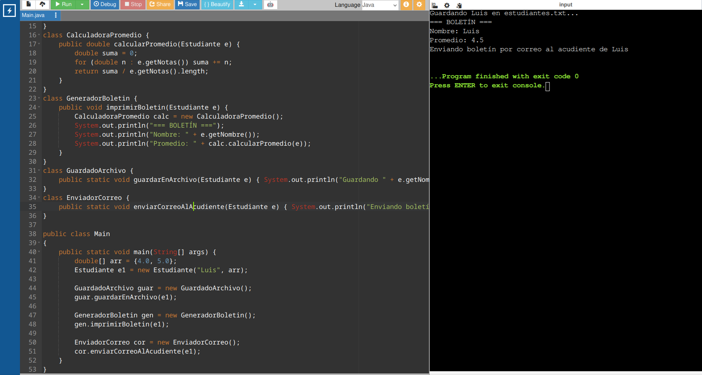

 # Taller SOLID

## Ejercicio S - Single Responsibility
### Código Original
```Java
public class Estudiante {
	private String nombre;
	private double[] notas;
	
	public Estudiante(String nombre, double[] notas) {
		this.nombre = nombre;
		this.notas = notas;
	}
	
	public double calcularPromedio() {
		double suma = 0;
		for (double n : notas) suma += n;
		return suma / notas.length;
	}
	
	public void guardarEnArchivo() {
		System.out.println("Guardando " + nombre + " en estudiantes.txt...");
	}
	
	public void imprimirBoletin() {
		System.out.println("=== BOLETÍN ===");
		System.out.println("Nombre: " + nombre);
		System.out.println("Promedio: " + calcularPromedio());
	}
	
	public void enviarCorreoAlAcudiente() {
		System.out.println("Enviando boletín por correo al acudiente de " + nombre);
	}
}
```

El código está mal porque la clase `Estudiante` tiene demasiadas responsabilidades. A través de la clase estudiante se guarda un estudiante y sus notas, se calcula el promedio, se guarda la información en un archivo de texto, se imprime el boletín y se envía este último al correo del acudiente del alumno. Es decir, tiene 5 funciones diferentes. Esto tiene una implicación negativa y es que en caso de que se decida crear un nuevo formato de boletín o se cambie el método de guardado de los estudiantes (por ejemplo, a una base de datos) se tiene que modificar la clase estudiante. 

### Corrección del código
```Java
class Estudiante {
    private String nombre;
    private double[] notas;
    	
    public Estudiante(String nombre, double[] notas) {
    	this.nombre = nombre;
    	this.notas = notas;
    }
    public String getNombre() {
        return this.nombre;
    }
    public double[] getNotas() {
        return this.notas;
    }
}
class CalculadoraPromedio {
    public double calcularPromedio(Estudiante e) {
    	double suma = 0;
    	for (double n : e.getNotas()) suma += n;
    	return suma / e.getNotas().length;
    }
}
class GeneradorBoletin {
    public void imprimirBoletin(Estudiante e) {
        CalculadoraPromedio calc = new CalculadoraPromedio();
        System.out.println("=== BOLETÍN ===");
        System.out.println("Nombre: " + e.getNombre());
        System.out.println("Promedio: " + calc.calcularPromedio(e));
    }
}
class GuardadoArchivo {
    public static void guardarEnArchivo(Estudiante e) { System.out.println("Guardando " + e.getNombre() + " en estudiantes.txt..."); }
}
class EnviadorCorreo {
    public static void enviarCorreoAlAcudiente(Estudiante e) { System.out.println("Enviando boletín por correo al acudiente de " + e.getNombre()); }
}

public class Main
{
    public static void main(String[] args) {
		double[] arr = {4.0, 5.0};
		Estudiante e1 = new Estudiante("Luis", arr); 
        
        GuardadoArchivo guar = new GuardadoArchivo();
        guar.guardarEnArchivo(e1);
		
		GeneradorBoletin gen = new GeneradorBoletin();
		gen.imprimirBoletin(e1);
		
		EnviadorCorreo cor = new EnviadorCorreo();
		cor.enviarCorreoAlAcudiente(e1);
	}
}

```
### Justificación de corrección
Para la corrección se decidió que la clase estudiante solo permitiera guardar y recuperar el nombre del estudiante y sus notas. Para esto se eliminaron de la clase `Estudiante` las funciones `calcularPromedio`, `enviarCorreoAlAcudiente`, `imprimirBoletin` y `guardarEnArchivo`, estas pasaron a ser clases independientes. Para que pudieran acceder a los datos de `Estudiante` se crearon métodos `getNotas` y `getNombre`; con esto ya es posible modificar independientemente la clase estudiante sin modificar el funcionamiento de as demás funciones y viceversa. De esta forma, `Estudiante` tiene una única función: almacenar los datos del estudiante. Lo mismo se puede decir de las demás clases. De esta forma, todas las clases tienen Single Responsibility.

Si por ejemplo, fuera necesario cambiar el formato del boletín, basta con modificar la clase `GeneradorBoletin`, lo mismo si se cambia el método de guardado de la información   una base de datos, sólo cambia el método `GuardadoArchivo`

### Capturas



## Ejercicio O - Open/Closed Principle
### Código Original
```Java
public class CalculadoraEnvio {
	public double calcular(String tipoEnvio, double peso) {
		if (tipoEnvio.equals("NORMAL")) {
			return peso * 2000;
		} else if (tipoEnvio.equals("EXPRESS")) {
			return peso * 5000 + 10000;
		} else if (tipoEnvio.equals("INTERNACIONAL")) {
			return peso * 15000 + 50000;
		}
		throw new IllegalArgumentException("Tipo de envío no soportado");
	}
}
```
La empresa debe modificar el `if-else` para agregar cualquier nuevo tipo de envío, en lo personal, si se establecen más de 5 métodos de envío ya deja de ser legible el código. Además, desde un punto de vista más formal, este  código es difícil de modificar, pues para añadir un nuevo método de envío se modifica el código de todos los demás.

### Corrección del código
```Java
interface Calculadora {
    public abstract double calcular(double peso);
}

class CalcEnvioNormal implements Calculadora {
    public double calcular(double peso) { return peso * 2000; }
}
class CalcEnvioExpress implements Calculadora {
    public double  calcular(double peso) { return peso * 5000 + 10000; }
}
class CalcEnvioInternacional implements Calculadora {
    public double  calcular(double peso) { return peso * 15000 + 50000; }
}
class CalcEnvioMismoDia implements Calculadora {
    public double calcular(double peso) { return peso * 8000 + 20000; }
}

public class Main
{
	public static void main(String[] args) {
		Calculadora calculadora = new CalcEnvioNormal();
		System.out.println("Precio envío normal:\t\t" + calculadora.calcular(5));
		calculadora = new CalcEnvioExpress();
		System.out.println("Precio envío express:\t\t" + calculadora.calcular(5));
		calculadora = new CalcEnvioInternacional();
		System.out.println("Precio envío internacional: \t" + calculadora.calcular(5));
		calculadora = new CalcEnvioMismoDia();
		System.out.println("Precio envío mismo dia:\t\t" + calculadora.calcular(5));
	}
}
```
### Justificación de corrección
Como corrección se propone independizar cada método de envío. Para ello se crea una interfaz de calculadora general a partir de la cuál se implementan las calculadoras específicas de cada tipo de envío. Con esto, cada clase es independiente y es relativamente fácil añadir una nueva versión de la calculadora, basta con crear una nueva clase. Así, cualquier añadido no modifica ni la interfaz padre ni sus clases hermanas. Considero que con estas  modificaciones se cumple el principio de Open/Closed.

### Capturas


## Ejercicio L - Liskov Substitution Principle
### Código Original
```Java
public class Archivo {
	 protected String contenido = "";
	 public String leer() { return contenido; }
	 public void escribir(String texto) { contenido += texto; }
}

public class ArchivoSoloLectura extends Archivo {
	@Override
	public void escribir(String texto) {
		throw new UnsupportedOperationException("Este archivo es de solo lectura");
	}
}

public class Editor {
	public void agregarFirma(java.util.List<Archivo> archivos) {
		for (Archivo a : archivos) {
			a.escribir("\n-- Firmado por el sistema");
		}
	}
}
```

Este código rompe el principio de Sustitución de Liskov porque el subtipo `ArchivoSoloLectura` no permite la escritura, sin embargo su clase padre (`Archivo`) si tiene este método. En términos más abstractos, al definir la escritura (`escribir`) y lectura (`leer`) en `Archivo` se esperaría que todos sus subtipos pudieran ejecutar, por lo menos, ambos métodos. Además, el código falla durante su ejecución porque se espera el método `escribir()` al recibir algo de tipo `Archivo` en `agregarFirma()`. 

Si alguien propone agregar el `if (!(a instanceof ArchivoSoloLectura))` dentro del ciclo, el código se ejecutará, sin embargo, seguirá sin cumplir la Sustitución de Liskov porque no resuelve el problema de que `ArchivoSoloLectura` no cumple con los métodos descritos en `Archivo`. Corrige el problema de `editor` pero no previene errores en el futuro con otras clases o funciones.

### Corrección del código
```Java
import java.util.List;
import java.util.LinkedList;

abstract class Archivo {
	 protected String contenido = "";
	 public String leer() { return contenido; }
}
interface Escribible {
    public void escribir(String text);
}

class ArchivoSoloLectura extends Archivo {}
class ArchivoEscrituraLectura extends Archivo implements Escribible {
    public void escribir(String texto) { contenido += texto; }
}
class Editor {
    public void agregarFirma(java.util.List<Escribible> archivos) {
    	for (Escribible a : archivos) {
    		a.escribir("\n-- Firmado por el sistema");
    	}
    }
}

public class Main
{
	public static void main(String[] args) {
    
    ArchivoEscrituraLectura arc = new ArchivoEscrituraLectura();
    arc.escribir("Merequetengue");
    
    ArchivoSoloLectura asl = new ArchivoSoloLectura();
    
    List<Escribible> list = new LinkedList();
    list.addLast(arc);
    list.addLast(asl);
    
    Editor editor = new Editor();
    editor.agregarFirma(list);
    
    System.out.println(arc.leer());
	}
}
```
### Justificación de corrección
Como corrección se plantea convertir `Archivo` en una clase abstracta que solo defina el método `leer()`. A partir de esta clase abstracta puede construirse `ArchivoSoloLectura`. Para la clase de `ArchivoEscrituraLectura` se crea una interfaz: `Escribible`, que define el metodo `escribir`. Con esta ultima se construye el `ArchivoEscrituraLectura` que tiene definidos los métodos de archivo y el método de escritura. 

Con esto se soluciona el problema de la sustitución de Liskov, pues ahora los archivos en general solo garantizan ser leídos, cosa que cumplen ambas clases. Si es necesario que algún archivo pueda ser modificado, se implementa con la interfaz de `Escribible`.

En temas concretos del código, se modifica Editor para que solo acepte una lista de archivos con interfaz `Escribible`, tal que pueda ejecutar la operación de escritura. En las capturas a continuación se muestra el error al intentar añadir a la lista un `ArchivoSoloLectura`. Después se muestra como, al comentar esa inserción, el código funciona de forma esperada.

### Capturas


## Ejercicio I - Interface Segregation Principle
### Código Original
```Java
public interface Dispositivo {
	void imprimir(String documento);
	void escanear(String documento);
	void enviarFax(String documento);
	void fotocopiar(String documento);
}

public class ImpresoraMultifuncional implements Dispositivo {
	public void imprimir(String d) { System.out.println("Imprimiendo " + d); }
	
	public void escanear(String d) { System.out.println("Escaneando " + d); }
	
	public void enviarFax(String d) { System.out.println("Enviando fax " + d); }
	
	public void fotocopiar(String d) { System.out.println("Fotocopiando " + d); }
}

public class ImpresoraBasica implements Dispositivo {
	public void imprimir(String d) { System.out.println("Imprimiendo " + d); }
	public void escanear(String d) { } // no puede
	public void enviarFax(String d) { } // no puede
	public void fotocopiar(String d) { } // no puede
}
```

Si bien la interfaz Dispositivo declara la existencia de métodos para imprimir, escanear, enviar un fax y fotocopiar, la `ImpresoraBasica` que implementa `Dispositivo` solo puede imprimir. Si se ejecuta `impresoraBasica.escanear("contrato")` o cualquiera de los métodos no definidos, falla silenciosamente, es decir, no se muestra ningún mensaje de error o algo que indique que la impresora básica no es capaz de escanear, simplemente no hace nada. Esto viola el principio de segregación de interfaces, pues se tiene una interfaz que define más de lo que hacen sus clientes. 

Además, si se agrega un método `enviarPorCorreo` a la interfaz, se tendrían que modificar `ImpresoraMultifuncional` e `ImpresoraBasica`, a pesar de que, en base a su definición actual, ninguna lo necesita.

### Corrección del código
```Java
interface Imprime { public void imprimir(String d); }
interface Escanea { public void  escanear(String d); }
interface Fotocopia { public void fotocopiar(String d); }
interface EnviaFax { public void enviarFax(String d); }

class ImpresoraMultifuncional implements Imprime, Escanea, Fotocopia, EnviaFax {
	public void imprimir(String d) { System.out.println("Imprimiendo " + d); }
	public void escanear(String d) { System.out.println("Escaneando " + d); }
	public void enviarFax(String d) { System.out.println("Enviando fax " + d); }
	public void fotocopiar(String d) { System.out.println("Fotocopiando " + d); }
}

class ImpresoraBasica implements Imprime {
	public void imprimir(String d) { System.out.println("Imprimiendo " + d); }
}

class Escaner implements Escanea {
    public void  escanear(String d) { System.out.println("Escaneando " + d); }
}

public class Main
{
	public static void main(String[] args) {
        
        ImpresoraBasica basic1 = new ImpresoraBasica();
        System.out.println("IMPRESORA BÁSICA");
        basic1.imprimir("Hola");
        //basic1.escanear("Hola");
        //basic1.enviarFax("Hola");
        //basic1.fotocopiar("Hola");
        
        ImpresoraMultifuncional multi1 = new ImpresoraMultifuncional();
        System.out.println("\nIMPRESORA MULTIFUNCIONAL");
        multi1.imprimir("Hola");
        multi1.escanear("Hola");
        multi1.enviarFax("Hola");
        multi1.fotocopiar("Hola");
    
        Escaner esc = new Escaner();
        System.out.println("\nESCANER");
        esc.escanear("Hola");
	}
}
```
### Justificación de corrección
Para corregirlo, se crearon interfaces para cada una de estas acciones (imprimir, escanear, enviarFax y fotocopiar) de modo que `ImpresoraMultifuncional` pueda tener todas, mientras que `ImpresoraBasica` implementa `Imprime` y `Escaner` solo implementa `Escanea`. De esta forma, no hay una interfaz que define métodos que sus hijos no usan.

Así, es más fácil definir dispositivos que cumplan con sólo algunas características, y en caso de que se intente hacer alguna operación no definida con ellos, sí se reporta un error  (en vez de fallar sin avisar). Este último comportamiento se muestra a continuación.

### Capturas


## Ejercicio D - Dependency Inversion Principle
### Código Original
```Java
public class MySQLDatabase {
	public void guardar(String dato) {
		System.out.println("[MySQL] Guardando: " + dato);
	}
}

public class ServicioUsuarios {
	private MySQLDatabase db = new MySQLDatabase();
	
	public void registrar(String nombreUsuario) {
		if (nombreUsuario == null || nombreUsuario.isBlank()) {
			throw new IllegalArgumentException("Nombre inválido");
		}
		db.guardar(nombreUsuario);
	 }
}
```
El código presenta una violación del principio de inversión de dependencias porque hace que el módulo `ServicioUsuarios` (que es un módulo de lógica de negocio) dependa de las llamadas a bajo nivel a la base de datos, no hay ninguna abstracción. Esto dificulta, por un lado, hacer testing de la clase `ServicioUsuarios` in tenre un base de datos conectada, por otro lado, la llamada a la base de datos dependen exclusivamente de `ServicioUsuarios`, lo que implica que, al cambiar de base de datos, sea necesario modificar la clase. 

## Corrección del código
#### Primera opción
```Java
interface Database { public void guardar(String dato);}

class MySQLDatabase implements Database {
	public void guardar(String dato) {
		System.out.println("[MySQL] Guardando: " + dato);
	}
}
class MongoDBDatabase implements Database {
    public void guardar(String dato) {
		System.out.println("[MongoDB] Guardando: " + dato);
    }
}
class ServicioUsuarios {
    private final Database db;
    
    public ServicioUsuarios(Database db) {
        this.db = db;
    }
    
    public void registrar(String nombreUsuario) {
		if (nombreUsuario == null || nombreUsuario.isBlank()) {
			throw new IllegalArgumentException("Nombre inválido");
		}
		db.guardar(nombreUsuario);
	}  
}

public class Main
{
	public static void main(String[] args) {
	    Database control = new MySQLDatabase();
        ServicioUsuarios serv = new ServicioUsuarios(control);
        serv.registrar("Juan");
        
        control = new MongoDBDatabase();
        serv = new ServicioUsuarios(control);
        serv.registrar("Luis");
	}
}
```
#### Segunda opción 
```Java
interface Database { public void guardar(String dato);}

class MySQLDatabase implements Database {
	public void guardar(String dato) {
		System.out.println("[MySQL] Guardando: " + dato);
	}
}
class MongoDBDatabase implements Database {
    public void guardar(String dato) {
		System.out.println("[MongoDB] Guardando: " + dato);
    }
}
class ServicioUsuarios {
    public void registrar(String nombreUsuario, Database db) {
		if (nombreUsuario == null || nombreUsuario.isBlank()) {
			throw new IllegalArgumentException("Nombre inválido");
		}
		db.guardar(nombreUsuario);
	}  
}

public class Main
{
	public static void main(String[] args) {
	    Database control = new MySQLDatabase();
        ServicioUsuarios serv = new ServicioUsuarios();
        serv.registrar("Juan", control);
        
        control = new MongoDBDatabase();
        serv.registrar("Luis", control);
	}
}
```
### Justificación de corrección
Para cada ambas soluciones la idea es la misma, hacer que la clase `ServicioUsuarios` no dependa de la llamada a una base de datos particular, sino que se emplee una interfaz que permite usar cualquier base de datos de forma intercambiable. Para esto se usa el patrón de inyección de dependencias. En el primer caso, es necesario para la creación del objeto `ServicioUsuarios` una base de datos (inyección en constructor). Para el segundo caso es necesario unicamente para el método `registrar()` (inyección de métodos). En ambos casos se consigue lo esperado, que la clase `ServicioUsuarios` no tenga que lidiar con la creación ni el manejo de la base de datos, sino que interactúe con esta a través de una abstracción.

### Capturas


